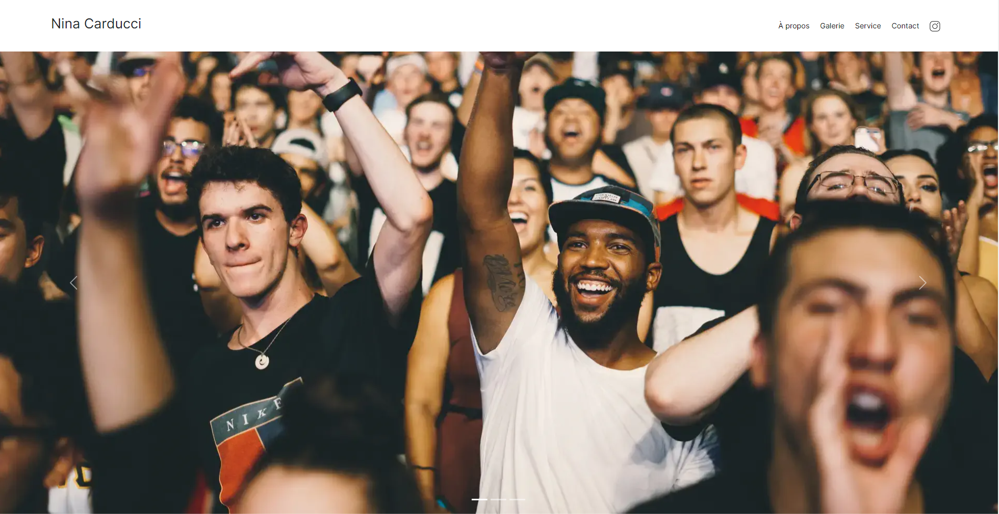
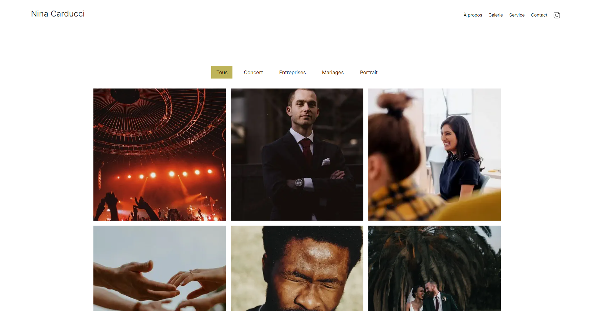

# Nina Carducci - Site de Photographe

Bienvenue dans le README du projet "Nina-carducci.fr", le site personnel d'une photographe talentueuse. En tant que développeur front-end, mon objectif principal était d'optimiser le site pour garantir des performances élevées, une expérience utilisateur fluide et une visibilité maximale dans les moteurs de recherche. Ce README vous guidera à travers les objectifs du projet, mes contributions et les techniques utilisées.

## Aperçu

"Nina-carducci.fr" est le portfolio en ligne d'une photographe professionnelle, mettant en valeur son travail artistique. Mon rôle en tant que développeur front-end était de rendre le site plus rapide, plus convivial et plus visible sur les moteurs de recherche, tout en respectant l'esthétique artistique de la photographe.

## Objectifs du Projet

- **Optimisation pour le SEO** : Mettre en place des bonnes pratiques SEO pour augmenter la visibilité du site dans les résultats de recherche.
- **Amélioration des Performances** : Réduire les temps de chargement en utilisant des CDNs, des minimificateurs et d'autres techniques d'optimisation.
- **Restructuration de l'Architecture** : Réorganiser l'architecture du site pour améliorer la navigation et la convivialité.
- **Optimisation des Images** : Réduire la taille des images sans compromettre la qualité visuelle.
- **Amélioration de l'Expérience Utilisateur** : Créer une expérience utilisateur fluide et attrayante à travers une interface réactive.

## Techniques Utilisées

- **CDNs** : Utilisation de réseaux de diffusion de contenu pour accélérer le chargement des ressources.
- **Minimificateurs** : Réduction de la taille des fichiers CSS et JavaScript en supprimant les espaces et les caractères inutiles.
- **Optimisation des Images** : Compression des images pour réduire leur taille tout en préservant la qualité.
- **Restructuration du Code** : Réorganisation du code HTML et CSS pour améliorer la lisibilité et la maintenabilité.
- **Meta Tags et Données Structurées** : Ajout de balises meta et de données structurées pour optimiser le référencement.
- **Améliorations de l'Accessibilité** : Mise en œuvre de bonnes pratiques d'accessibilité pour rendre le site utilisable par tous.

## Contributions Personnelles

En tant que développeur front-end sur ce projet, mes contributions comprenaient :

- L'optimisation du code existant pour améliorer les performances du site.
- La mise en place de CDNs pour accélérer le chargement des ressources.
- L'application des meilleures pratiques SEO pour maximiser la visibilité en ligne.
- La réduction de la taille des images tout en maintenant leur qualité visuelle.
- La restructuration de l'architecture du site pour une meilleure expérience utilisateur.

## Instructions d'Installation

1. Clonez ce dépôt sur votre machine locale.
2. Naviguez vers le dossier du projet.
3. Ouvrez le fichier `index.html` dans votre navigateur pour visualiser le site.

## Captures d'Écran

---

Ce projet a été une opportunité passionnante pour moi d'appliquer mes compétences en développement front-end pour améliorer les performances et la visibilité d'un site artistique. J'espère que les optimisations mises en œuvre contribueront à rendre le travail exceptionnel de la photographe encore plus accessible en ligne.

Pour toute question ou collaboration, n'hésitez pas à me contacter.

**Développeur Front-End:** Lucas O
**Date:** JUIN 2023
